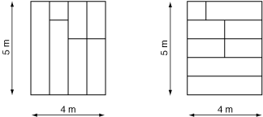

# Problema [1086 - O Salão do Clube](https://www.beecrowd.com.br/judge/pt/problems/view/1086)

O Clube Recreativo de Tinguá está construindo a sua nova sede social. Os sócios desejam que o piso do salão da sede seja de tábuas de madeira, pois consideram que este é o melhor tipo de piso para os famosos bailes do clube. Uma madeireira da região doou uma grande quantidade de tábuas de boa qualidade, para serem utilizadas no piso. As tábuas doadas têm todas a mesma largura, mas têm comprimentos distintos.

O piso do salão da sede social é retangular. As tábuas devem ser colocadas justapostas, sem que qualquer parte de uma tábua seja sobreposta a outra tábua, e devem cobrir todo o piso do salão. Elas devem ser dispostas alinhadas, no sentido longitudinal, e todas devem estar no mesmo sentido (ou seja, todas as tábuas devem estar paralelas, no sentido longitudinal). Além disso, os sócios não querem muitas emendas no piso, e portanto se uma tábua não é longa o bastante para cobrir a distãncia entre um lado e outro do salão, ela pode ser emendada a no máximo uma outra tábua para completar a distância.

Há porém uma complicação adicional. O carpinteiro-chefe tem um grande respeito por todas as madeiras e prefere não serrar qualquer tábua. Assim, ele deseja saber se é possível forrar todo o piso com as tábuas doadas, obedecendo às restrições especificadas; caso seja possível, o carpinteiro-chefe deseja ainda saber o menor número de tábuas que será necessário utilizar. A figura abaixo ilustra duas possíveis maneiras de forrar o piso de um salão com dimensões 4 × 5 metros para um conjunto de dez tábuas doadas, com 100 cm de largura, e comprimentos 1, 2, 2, 2, 2, 3, 3, 4, 4 e 5 metros.

## Entrada
A entrada contém vários casos de teste. A primeira linha de um caso de teste contém dois inteiros M e N indicando as dimensões, em metros, do salão (1 ≤ N,M ≤ 104). A segunda linha contém um inteiro L, representando a largura das tábuas, em centímetros(1 ≤ L ≤ 100). A terceira linha contém um inteiro, K, indicando o número de tábuas doadas (1 ≤ K ≤ 105). A quarta linha contém K inteiros Xi, separados por um espaço, cada um representando o comprimento, em metros, de uma tábua (1 ≤ Xi ≤ 104 para 1 ≤ i ≤ K). O final da entrada é indicado por uma linha que contém apenas dois zeros, separados por um espaço em branco.  

## Saída
Para cada um dos casos de teste da entrada, seu programa deve imprimir uma única linha, contendo o menor número de tábuas necessário para cobrir todo o piso do salão, obedecendo às restrições estabelecidas. Caso não seja possível cobrir todo o piso do salão obedecendo às restrições estabelecidas, imprima uma linha com a palavra ‘impossivel’ (letras minúsculas, sem acento).  

  
Solução 1:

  O principal problema desse exercício é que ao tentar por força bruta da timeout, então armazenar o valor de cada tábua individualizado não é uma boa opção. 
  
  Para essa solução se armazenou num map um inteiro chave para o tamanho da tábua, e um inteiro valor para a quantidade de tabuas daquele tamanho. Como eu devo fazer dois tipos de verificações, uma para posicionando as tábuas alinhadas na horizontal e outro para as tábuas na vertial, criei uma função genérica no qual eu passo a largura do quarto e a quantidade de linhas de tabuas que devo posicionar (comprimento do quarto / largura da tábua, obs: se esse for um valor quebrado não é necessário fazer a chamada) e ela me retorna a quantidade de tábuas mínima, ou -1 se impossivel. No caso é chamado a primeira vez a função com as linhas de tábuas sendo o comprimento do quarto, e depois é chamado para as linhas sendo a largura do quarto, é pego o menor valor entre as duas chamadas e printado na tela, caso ambas sejam -1 ele apenas printa __impossivel__.

  ### Calculo de quantidade mínima de tábuas

  Dado a largura que uma linha deve ser preenchida, a quantidade de linhas de tábuas necessárias e o map com a relação de tamanhã das tábuas e quantidade.

  Para o calculo de quantidade de tábuas mínimas, eu utilizei dois contadores, um para a quantidade de linhas preenchidas, e outro para a quantidade de tábuas usadas. Primeiro eu verifico no map que eu declarei se existem tábuas que são exatamente do tamanho necessário para preencher uma linha completa, se existem eu incremento a quantidade de tábuas desse tamanho na quantidade de linhas preenchidas e na quantidade de tábuas utilizadas.

  Depois que eu preenchi todas as linhas com as tábuas solos, vou buscar as linhas com as tábuas em dupla, então eu passo num for de LARGURA-1 até >LARGURA/2 e verifico se para uma tábua de tamanho X ela tem um correspondente de tamanho LARGURA-X, e se tem eu verifico o menor valor entre esses dois grupos de tábuas, e incremento na quantidade de linhas preenchidas e o dobro na quantidade de tábuas utilizadas.

  E no final para não esquecer o ultimo caso de poder utilizar duas tábuas de tamanhos iguais. Esse caso só se aplica para largura par, pois não existem tábuas de tamanho um numero não inteiro. Então eu pego o número de tábuas que tem tamanho metade, e incremento no número de tábuas utilizadas ao mesmo tempo que incremento metade no número de linhas preenchidas.

  No __return__ eu só verifico se eu preenchi todas as linhas necessárias, se não eu retorno -1 (impossivel), se eu preenchi eu retorno o número de tábuas utilizadas. Algumas observações são que se em alguma etapa eu já preenchi todas as linhas necessárias eu devo pular proximas etapas até a verificação do return, e se eu tiver mais linhas preenchidas que o que necessário, possivelmente estou utilizando mais tábuas que o mínimo, então vai estar errado a resposta.

- [Luiz H. Lago](https://github.com/crazynds)

